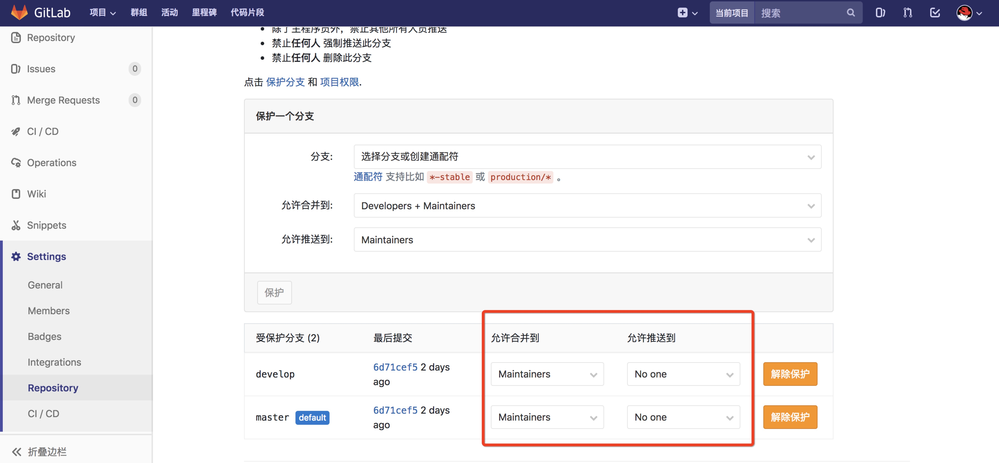

# 分支管理说明

### 分支说明

- 蓝色圆点所在的线为源码的主线（master）
    - 主分支是唯一能够完全反应线上环境的分支
    - 该分支只读，不接受push，只能从其他分支merge
    - 所有在该分支发生的merge操作，均需要tag操作
- 蓝色方形指向的节点是每一个发布版本的标签（tag）
- 紫色圆点所在的线为开发分支线（develop）
    - 所有的开发功能都将合并到该分支，进行开发环境验证
    - 该分支只读，不接受push，只能从feature或者hotfix分支merge
- 黄色圆点所在的线为新功能开发分支线（feature）
    - 功能开发分支 , 基于develop分支克隆 , 主要用于新需求新功能的开发
    - feature分支为开发人员自行创建
    - feature分支可同时存在多个 , 用于团队中多个功能同时开发 , 属于临时分支 , 功能完成后可选删除
    - feature分支支持push操作
- 绿色圆点所在的线为新版本发布线（release）
    - 该分支只读，不接受push，只能从develop分支merge
    - 属于临时分支 , 功能上线后可删除
- 红色圆点所在的线为发布版本bug修复线（hotfix）
    - 补丁分支 , 基于master分支克隆 , 主要用于对线上的版本进行BUG修复
    - 修复完毕后合并到develop/master分支并推送 , 打Tag
    - 属于临时分支 , 补丁修复上线后可选删除
    - 该分支接受push操作
- 再一次强调，除红色（hotfix）和黄色（feature)分支以外，所有分支均不接受push，均需要通过merge request方式提交代码

### 分支命名约定
- 主分支名称：master
- 主开发分支名称：develop
- 标签（tag）名称：v*，其中”*“ 为版本号，如：v1.0.0
- 新功能开发分支名称：feature/*，其中“*” 为新功能对应的jira编号，如：feature/jira888
- 发布分支名称：release/*，其中*为版本号，“release”小写，如：release/1.0.0
- master的bug修复分支名称： hotfix/*，其中*为对应的jira编号，如：hotfix/jira009

### 提交注释约定（暂定）

格式: type/jiraID/简单描述s

type 类型如下：

- md: 修改（Modify）
- ad: 新增（Add）
- rm: 移除（Remove）
- rf: 重构（Refactory）

例子：

ad/jira999/实现用户注册功能

王城提到可以使用这个工具进行提交注释规范，目前暂时还需要考虑是否合适引进：

https://github.com/carloscuesta/gitmoji-cli

### 分支保护设定

gitlab -> 项目 -> settings -> Repository -> 保护分支

可见上图中，master分支和develop分支均设置为不接受push，而且只允许主程序员级别的程序员可以进行merge操作（开发程序员可以从其他分支比如feature分支发起merge request）

