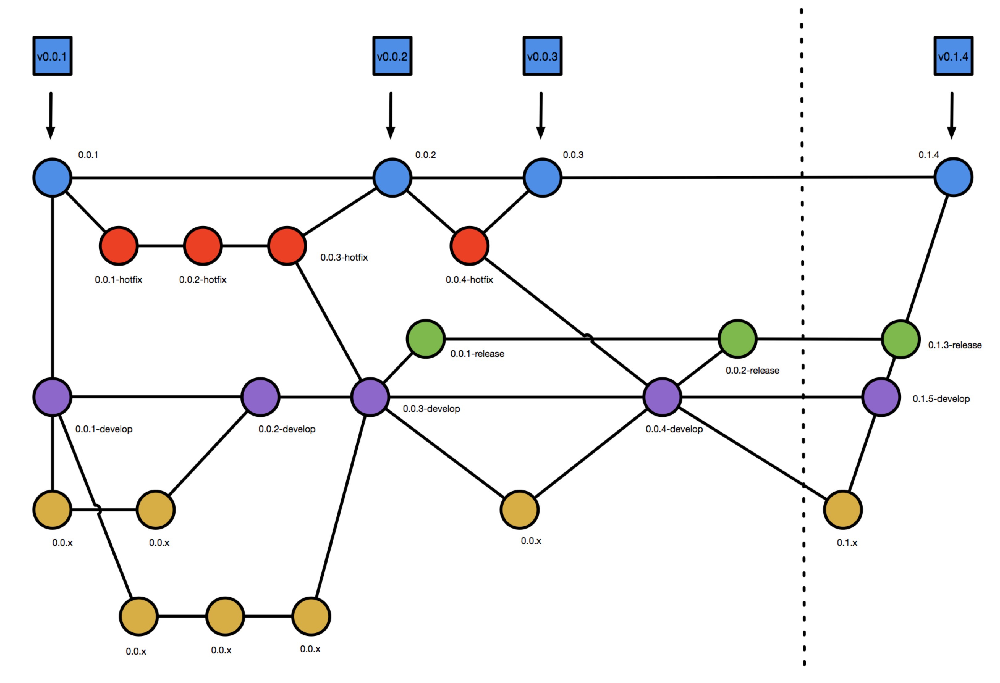

# master分支集成

master分支有两种情况需要进行集成

 - release分支已经进行了充分测试，此时需要进行最终的验收测试，可以将release分支的代码合并到master分支，进行最终的集成验收测试并部署到生产环境。
 - 线上环境发生故障，通过hotfix分支进行修复之后，要将hotfix分支的代码合并到master分支以及develop分支，进行最终的集成验收测试并部署到生产环境。



 当某一个release分支经过集成验收测试之后，已经达到发布状态，此时则需要进行版本号升级。这标志着进入了上图中的虚线右侧阶段。

 因为master, release, develop分支均有严格的分支保护限制，故要修改pom.xml文件里面的版本号，唯一的办法就是从develop分支迁出一个临时分支，仅仅修改pom.xml里面的版本号。

 此时，pom.xml里面的版本值是：

 ```version
<version>0.0.${revision}</version>
 ```

 需要对y位的值进行增加，标志着即将发布新版本。当然，如果是非常大的一次发布，有可能要对x值进行增加。此时只对y值进行变更：

  ```version
<version>0.1.${revision}</version>
 ```

 将该临时feature分支代码合并到develop分支，如果此时在develop分支构建，则会构建出 0.1.5-develop这样的版本，因为最后一个z值是jenkins的构建次数形成的，故其是一个非确定的值。

 类似的，将develop分支合并到release分支，构建之后也会发现构建出的版本号变成了 0.1.4-release这样的版本。

 最终从release分支合并到master分支之后，版本号将为0.1.4。将这个版本在验收测试环境上进行最后测试，如果没有问题，该版本则可以发布。