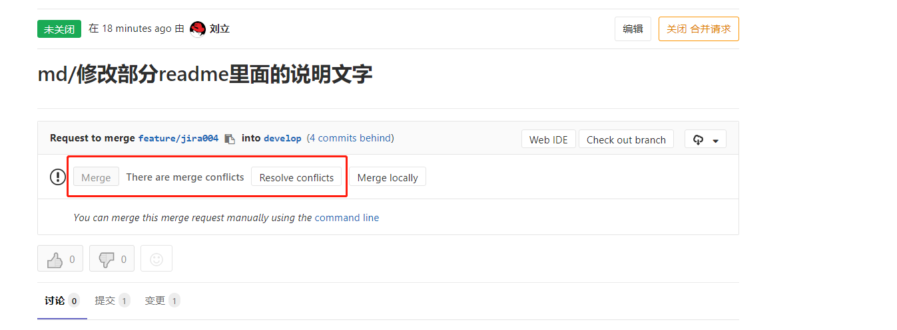
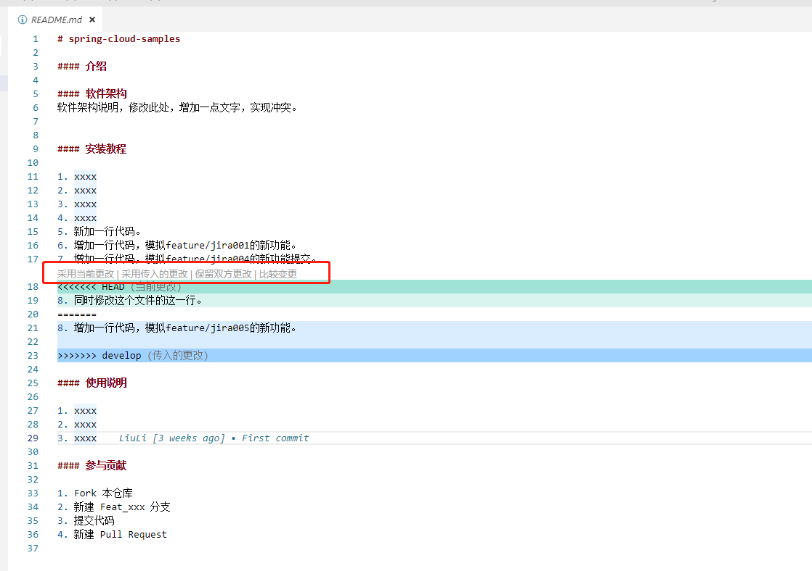
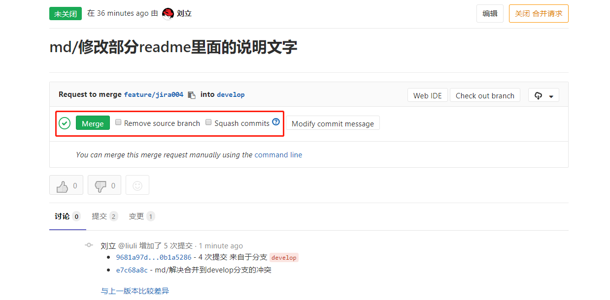

# 冲突解决

在具备合并权限的工程师合并代码的时候，有时候会发生提交冲突

一般的场景是，开发工程师开发完部分功能，然后将自己的分支提交到gitlab的远程分支，然后发起merge request请求要求合并到develop分支

有合并权限的工程师在gitlab上进行合并的时候，发现冲突



可以看出，提示此处存在冲突，需要解决之后才能合并。

此时，具备合并权限的工程师不应该合并代码，而是应该要求发起该merge request合并完成之后重新提交

流程如下：

#### 1. 具备合并权限的工程师不用做任何操作，直接告知发起merge request的工程师此时代码有冲突，需要解决

开发相关分支（图中是feature/jira004）的工程师需要在本地切换到develop分支，并更新代码

```develop
git checkout develop
git pull
```

#### 2. 然后切换到发起merge request并且发生冲突的分支，在本地合并develop分支

```merge
git checkout feature/jira004
git merge develop 
```

#### 3. 此时会发生冲突并且会要求解决，下图以vs code的开发界面为例：



不同的IDE会有不同的冲突解决界面，在解决完冲突之后，重新提交代码并push到远程的feature/jira004分支

#### 4. 此时具备合并权限的工程师只需要刷新之前的merge request界面，就发现已经和merge代码了。


