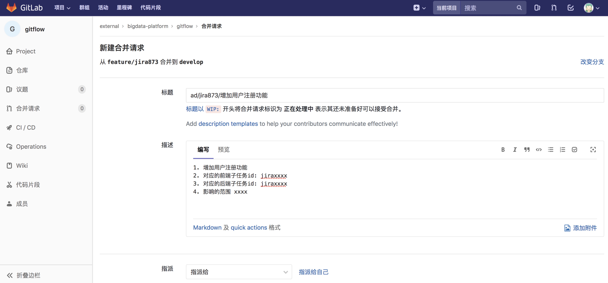
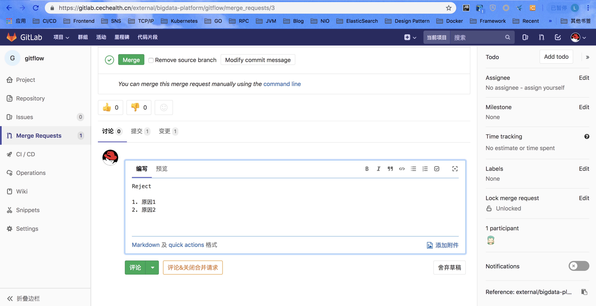
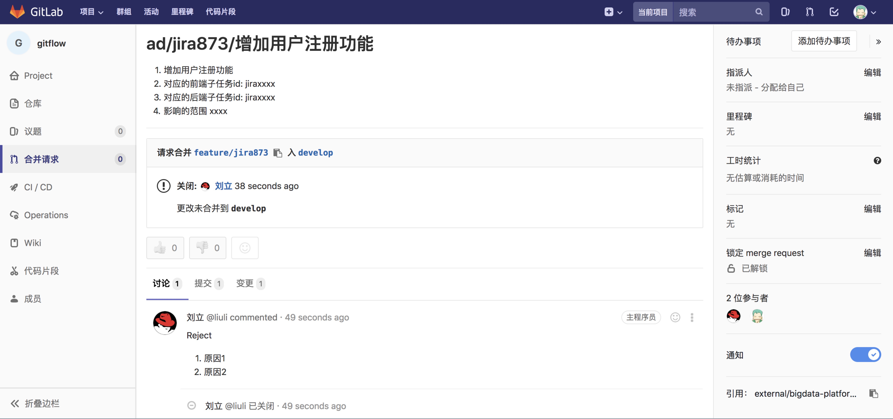
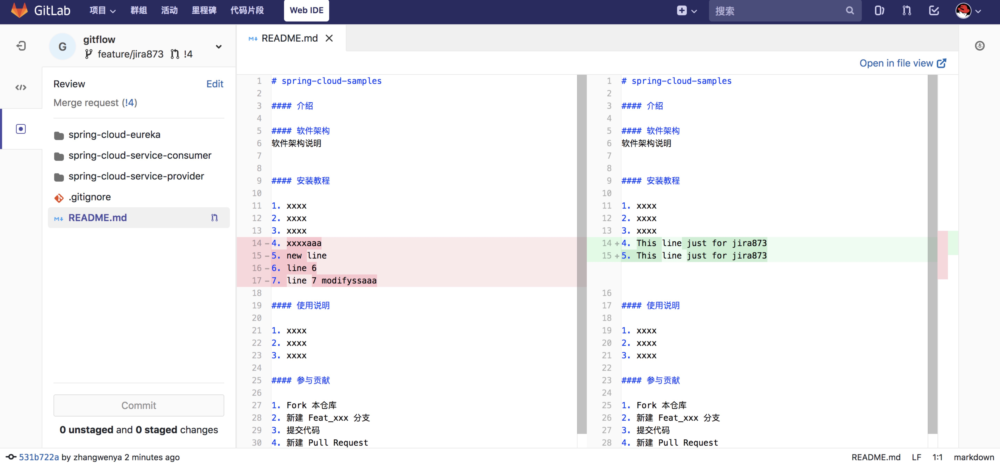
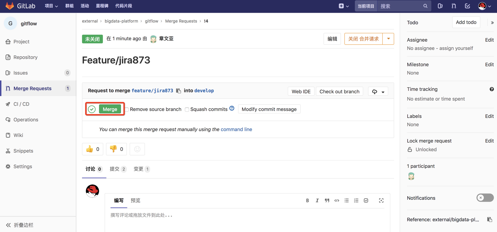

# 开始新功能

### 1. 新功能开发流程


- 紫色圆点所在的线为开发分支线（develop）
- 黄色圆点所在的线为新功能开发分支线（feature）

每次迭代开始时，应首先从master分支迁出develop分支，然后开发人员根据自己安排，从develop分支迁出feature分支。

基于git服务器上的develop分支创建feature分支

```start
git checkout -b feature/jira873 remotes/origin/develop
```

推送该分支到服务器上，以便共享以及开发完之后合并到develop分支中进行开发环境测试。

```push
git push --set-upstream origin feature/jira873
```

### 2. 发起代码合并请求（merge request）

此时可以对该feature进行各种代码编辑工作。当某个功能开发完成之后，如果需要将该分支合并到develop分支，需要在gitlab里发起merge request





### 3. 代码评审


### 4. 评审驳回

在上面的代码评审过程中，具备评审权限的工程师认为本次合并条件不成熟（代码有问题），希望相关负责开发的工程师修改代码之后再合并，于是可以填写驳回原因，驳回本次合并请求。



相关开发工程师可以在自己的gitlab界面里看到被驳回的合并请求，然后按照原因进行更改。



### 5. 评审通过，合并

具备合并权限的工程师在代码评审之后认为合并可以接受的时候，可以决定合并代码


选择合并


可以看到合并之后的结果


### 6. 开发过程中功能放弃

有时候在开发过程中，有可能某个功能在开发一段时间之后因为某些原因放弃继续开发。主要有以下两种情况。

#### 已经将代码从feature分支merge到develop分支，此时还没有其他分支merge过去。

解决方案，直接把develop分支回滚到该提交之前就可以了：

以 https://gitlab.cechealth.cn/external/bigdata-platform/gitflow 项目为例，假设现在我们要开始开发一个新功能，jira编号是jira002，于是我们会在develop分支上拉出一个新分支 feature/jira002，在这个分支之前，已经有一个 feature/jira001 提交并合并到了develop分支。

```code
git checkout -b feature/jira002 remotes/origin/develop
```

按照之前的约定我们需要把feature/jira002推到服务器上，以便协同工作
```push
git push --set-upstream origin feature/jira002
```

工程师在feature/jira002上进行开发，增加一些代码如下。


然后提交到远程feature/jira002分支，然后按照 merge request 的流程，申请把 feature/jira002 合并到develop分支，这里假设代码评审通过，具有合并权限的工程师接受了该合并请求，最终合并出来的效果如下。


可以看到由feature/jira002新增的代码已经合并到了develop分支里。


此时，开发计划有变，或者其他原因，要废弃掉jira002相关的功能。


现在，为了验证我们的撤销，切换到develop分支，和撤销提交的再前一次提交比对，发现没有任何差异。说明撤销成功。

```success
git diff e216d95d
```

至此，撤销成功。


#### 在该分支合并到develop分支之后，已经有多个分支合并到develop分支了。

此时最合适的办法只能是在develop分支中新开出一个分支，在该分支上删除要废弃的相关代码，然后提交，然后合并。

#### 代码还只是在feature/jiraxxx 分支里面，此时如果已经<font color="red">确定</font>这个功能要放弃掉。

可以直接删除feature/jiraxxx分支

删除本地的 feature/jiraxxx 分支

```deletelocao

```

